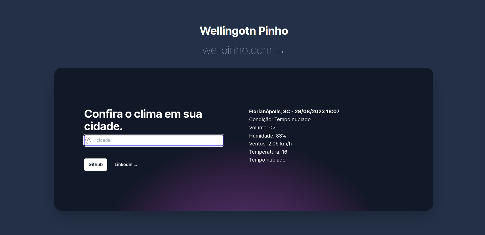

<h1 align="center">Weather Today</h1>
<h2 align="center"><a href="https://weather-today-theta.vercel.app/">https://weather-today-theta.vercel.app/</a></h2>

  

  

## ✨ Tecnologias

Esse projeto foi desenvolvido com as seguintes tecnologias:

- [Typescript](https://www.typescriptlang.org/)
- [Nextjs](https://nextjs.org/)

Consumindo os dados informativos do tempo na api da HG Brasil

- [API](https://hgbrasil.com/)

## 💻 Projeto

Weather Today é um app que informa como esta o tempo em sua cidade..

## 🚀 Como executar

- Clone o repositório
- 1. `git clone https://github.com/wellpinho/weather-today.git`
- 2. `cd weather-today`
- 3. `npm i` para instalar as dependências
- 4. o `npm run dev` para iniciar a aplicação.

Acesse as rotas pelo Postman ou Insomnia: `http://localhost:3000`

## 📄 Licença

- Esse projeto está sob a licença MIT. Veja o arquivo [LICENSE](LICENSE.md) para mais detalhes.
- Este app nasceu a partir da aula do curso CJRM do professor Roger Melo: [Link do curso](https://app.nutror.com/curso/977a43d31cedcb6e7d064649ddd6c5436155aaf)

Feito com dedicação e paixão pela programação em geral &nbsp;by Wellington Pinho 👋🏻 &nbsp;
[Meu Linkedin](https://www.linkedin.com/in/wellpinho/)
[Meu Portfólio](https://wellpinho.com)
